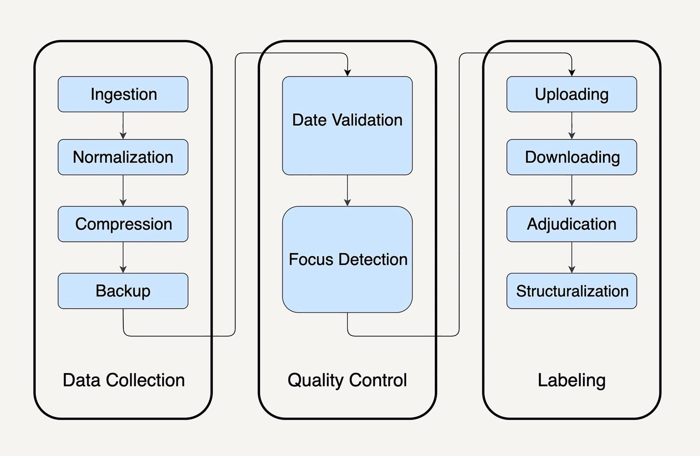

# Large-scale data processing framework

MapReduce已经被淘汰了 因为维护的成本相当高 而且泛化衍生的能力不强。MapReduce的一个局限是他为了批处理而设计的，应对流处理的时候不太行。

一个标准数据处理流程

我们理想的框架应该不需要复杂的配置 能够自动进行性能优化。对于框架的设计思路，我们要能把数据处理的描述语言，与背后的运行引擎解耦合开来。

