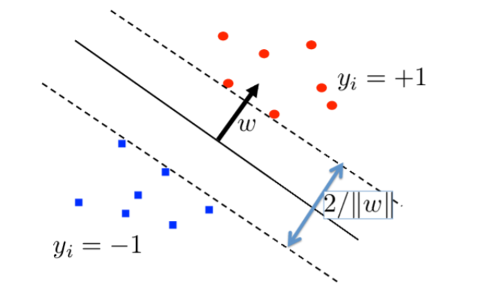

# Support Vector Machine

## The representer theorem

Given a set of paired observation $$(x_{1}, y_{1}),..., (x_{n}, y_{n})$$ \(regression or classification\). Find the function $$f^{*}$$ in the RKHS $$\mathcal{H}$$ which satisfies:

$$f^{*} = \arg \min_{f \in \mathcal{H}} J(f)$$ 

where $$J(f) = L_{y}(f(x_{1}),...,f(x_{n}))+ \Omega (\lVert f \rVert^{2}_{\mathcal{H}})$$, $$\Omega$$ is non-decreasing. $$y$$ is the vector of $$y_{i}$$, Loss $$L$$ depends on $$x_{i}$$only via $$f(x_{i})$$ .

* Classification: $$L_{y} (f(x_{1}), ...,f(x_{n})) = \sum^{n}_{i=1} \mathcal{I}_{y_{i} f(x_{i}) \le 0 }$$ 
* Regression: $$L_{y}(f(x_{1}),...,f(x_{n})) = \sum^{n}_{i=1} (y_{i} - f(x_{i}))^{2}$$ 

Hence, The representer theorem: a solution to 

$$min_{f\in \mathcal{H}} \left [ L_{y}(f(x_{i}),...,f(x_{n}))+ \Omega (\lVert f \rVert)^{2}_{\mathcal{H}} \right ]$$ 

takes the form 

$$f^{*} = \sum^{n}_{i=1} \alpha_{i} k(x_{i}, \cdot)$$ 

if $$\Omega$$ is strictly increasing, the solution must have this form. 

## Convex optimization

### Convex set Definition

> C is convex if for all $$x_{1}, x_{2} \in C$$ and any $$0 \le \theta \le 1$$ we have $$\theta x_{1} + (1-\theta)x_{2} \in C$$ , i.e. every point on the line between $$x_{1}$$ and $$x_{2}$$ lies in $$C$$.

### Convex function Definition

> A function $$f$$ is **convex** if its domain $$domf$$ is a convex set and if $$\forall x,y \in dom f$$, and any $$0 \le \theta \le 1$$, $$f(\theta x + (1-\theta)y) \le \theta f(x) +(1-\theta)f(y)$$. The function is **strictly convex** if the inequality is strict for $$x \neq y$$  .

Generic Optimisation problem on $$x \in \mathcal{R}^{n}$$ ,

$$minimize \quad f_{0}(x) \\subject \ to \quad f_{i}(x) \le 0 \quad i=1,...,m (5)\\\quad \quad \quad \quad\quad \ h_{i}(x) = 0 \quad i=1,...,p$$ 

$$p^{*}$$ the optimal value of \(5\), $$\mathcal{D}$$ assumed nonempty, where

$$D:= \bigcap^{m}_{i=0} domf_{i} \cap \bigcap^{p}_{i=1} domh_{i} \\ (dom f_{i} = subset\ of \ \mathcal{R}^{n} \ where \ f_{i} \ defined.)$$  

Ideally we would want an unconstrained problem, Hence, we have

$$minimize \quad f_{0}(x) + \sum^{m}_{i=1} I\_(f_{i}(x)) +\sum^{p}_{i=1} I_{0}(h_{i}(x))$$ 

where $$I\_(u) = \left\{ \begin{aligned} 0 & = u \le 0 \\ \infty & = u>0 \\  \end{aligned} \right.$$  and $$I_{0}(u)$$ is the indicator of 0. 

然后我们引出拉格朗日

The _**Lagrangian L**_: $$\mathcal{R}^{n} \times \mathcal{R}^{m} \times \mathcal{R}^{p} \to \mathcal{R}$$ is a lower bound on the original problem:

$$L(x, \lambda, \nu): = f_{0}(x) +\sum^{m}_{i=1} \underbrace{\lambda_{i}f_{i}(x)}_{\le I\_({f_{i}(x)})} + \sum^{p}_{i=1} \underbrace{\nu_{i}h_{i}(x)}_{\le I_{0}(h_{i}(x))}$$ 

and has domain $$domL:= \mathcal{D} \times \mathcal{R}^{m} \times \mathcal{R}^{p}.$$ The vectors $$\lambda$$ and $$\nu$$ are called _**lagrange multipliers**_ or _**dual variables**_. To ensure a lower bound, we require $$\lambda \succeq 0$$ .

为了找到Lagrangian的解法，我们引出_**Largrange dual function**_

The _**Lagrange dual function**_: minimize Lagrangian 

when $$\lambda \succeq 0$$ and $$f_{i}(x) \le 0$$ , Lagrange dual function is

$$g(\lambda, \nu):= \inf_{x\in \mathcal{D}} L(x, \lambda, \nu)$$ 

A _**dual feasible**_ pair $$(\lambda, \nu)$$ is a pair for which $$\lambda \succeq 0 $$ and $$(\lambda, \nu) \in dom(g)$$ .

we can show that: for any $$\lambda \succeq 0$$ and $$\nu$$, $$g(\lambda, \nu) \le f_{0}(x)$$, wherever $$f_{i}(x) \le 0$$ , $$h_{i}(x)=0$$ .\( Including at $$f_{0}(x^{*}) = p^{*}$$ \).

Then, we can also show: When $$\lambda \succeq 0$$ , then for all $$\nu$$ we have $$g(\lambda, \nu) \le p^{*}$$ 

即Largrange dual is lower bound on $$p^{*}$$ .

> Proof:
>
> Assume $$\widetilde{x}$$ is feasible, i.e. $$f_{i}(\widetilde{x}) \le 0$$, $$h_{i}(\widetilde{x}) =0$$, $$\widetilde{x} \in \mathcal{D}$$ , $$\lambda \succeq 0$$ . Then, 
>
> $$\sum^{m}_{i=1} \lambda_{i} f_{i}(\widetilde{x}) + \sum^{p}_{i=1} \nu_{i}h_{i}(\widetilde{x}) \le 0$$ 
>
> Thus, 
>
> $$g(\lambda, \nu):= \inf_{x \in \mathcal{D}}\left( f_{0}(x)+ \sum^{m}_{i=1}\lambda_{i}f_{i}(x) +\sum^{p}_{i=1} \nu_{i}h_{i}(x) \right) \\ \le f_{0}(\widetilde{x}) +\sum^{m}_{i=1} \lambda_{i}f_{i}(\widetilde{x}) +\sum^{p}_{i=1}\nu_{i}h_{i}(\widetilde{x}) \\ \le f_{0}(\widetilde{x})$$ 
>
> This holds for every feasible $$\widetilde{x}$$ , hence lower bound holds.

然后我们的目标转换为 最大化 $$g(\lambda, \nu)$$     

Lagrange dual problem

$$maximize \quad g(\lambda, \nu) \\ subject \ to  \quad \lambda \succeq 0$$ 

**Dual feasible**: $$(\lambda, \nu) $$ with $$\lambda \succeq 0$$ and $$g(\lambda, \nu) > - \infty$$

**Dual optimal**: solutions $$(\lambda^{*}, \nu^{*})$$ maximizing dual, $$d^{*}$$ is optimal value 

_**Weak duality**_ : always holds: $$d^{*} \le p^{*}$$ 

_**Strong duality**_: \(does not always hold, conditions given later\): $$d^{*} = p^{*}$$ 

Conditions: 

* primal problem convex and 
* constraint functions satisfy _**Slater's conditions**_ then strong duality holds.
* if in addition functions $$f_{i}, h_{i}$$ _**differentiable**_ then KKT conditions necessary and sufficient for optimality.

### KKT conditions for global optimum

Assume functions $$f_{i}, h_{i}$$ are _**differentiable**_ and _**strong duality**_. Since $$x^{*}$$ minimizes $$L(x, \lambda^{*}, \nu^{*})$$, derivative at $$x^{*}$$ is zero,

$$\nabla f_{0}(x^{*}) +\sum^{m}_{i=1} \lambda_{i}^{*} \nabla f_{i}(x^{*}) +\sum^{p}_{i=1} \nu_{i}^{*} \nabla h_{i}(x^{*}) =0.$$ 

_**KKT conditions definition**_: we are at _**global optimum**_,  $$(x, \lambda, \nu) = (x^{*}, \lambda^{*}, \nu^{*}) $$ when \(a\) _**strong duality**_ holds, and \(b\) 

primal feasibility 

$$f_{i}(x) \le 0, i=1,...,m \\ h_{i}(x) = 0, i=1,...,p$$ 

dual feasibility 

$$\lambda_{i} \ge 0, i=1,...,m$$ 

complementary slackness

$$\lambda_{i} f_{i}(x) = 0, i=1,...,m$$ 

Zero derivatives:

$$\nabla f_{0}(x) +\sum^{m}_{i=1} \lambda_{i} \nabla f_{i}(x) +\sum^{p}_{i=1} \nu_{i} \nabla h_{i}(x) =0$$ 

## Support vector classification

 

Smallest distance from each class to the _**separating hyperplane**_ $$w^{T}x+b$$ is called the _**margin**_.

This problem can be expressed as follows: 

$$\max_{w,b} (margin) = \max_{w,b} (\frac{2}{\lVert w\rVert})$$ 

$$subject \ to \ \left\{ \begin{aligned} \min(w^{T}x_{i}+b) & = 1  \quad & i: y_{i} =+1 \\ \max(w^{T}x_{i}+b) & = -1 \quad & i:y_{i} = -1 \\  \end{aligned} \right.$$ 

The resulting classifier is $$y = sign(w^{T}x+b)$$ 

当我们允许有少部分错误时，我们可以把式子写成：

$$\min_{w,b} (\frac{1}{2} \lVert w \rVert^{2} + C \sum^{n}_{i=1} \mathbb{I}[y_{i}(w^{T}x+b)<0])$$  这里的 $$\mathbb{I}$$ 表示个数

where C controls the trade off between maximum margin and loss.

然后这里我们换成Hinge loss\(为了有一个convex upper bound\)

$$\min_{w,b} (\frac{1}{2} \lVert w \rVert^{2}+C \sum^{n}_{i=1} \theta (y_{i}(w^{T}x_{i}+b)))$$ 

为了弥补换成Hinge loss造成的差异 我们加入新的参数 $$\xi$$

$$\min_{w,b,\xi} (\frac{1}{2} \lVert w \rVert^{2}+ C\sum^{n}_{i=1} \xi_{i})$$ 

$$subject \ to \quad \xi_{i}\ge0 \quad y_{i}(w^{T}x_{i}+b) \ge 1- \xi_{i}$$ 



