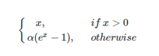

# Skip-gram & CBOW







### 模型 <a id="&#x6A21;&#x578B;"></a>

skipgram model 常常让人惊讶于它的简单结构。我认为基本没啥弯路，或者需要复杂的模型解释。

让我们从高层语义开始。Word2Vec 使用了一个小trick，你可能在其他machine learning问题中见过。我们训练一个简单的网络来执行一个任务，但是最乎我们实际上并没有用这个网络 来预测 test中的任务。而是，利用这个任务（目标）去学习网络中的权重W。我们将看到这些学出来的权重W就是我们所要的词向量（word vectors）。

> 你可能会见到这个trick，的另一个地方是 auto-encoder。 auto-encoder 常常用来压缩一个输入，然后再把压缩后的结果解压回去。在训练完成之后，你可以把解压的网络扔掉，只使用压缩的网络。这就是一个trick来获得 无监督下 好的图像特征。

### 假任务 <a id="&#x5047;&#x4EFB;&#x52A1;"></a>

那现在我们来讨论一下我们所要建立网络的训练任务（假任务）。然后我们再来讨论为什么这个任务可以间接地学习到想要的word vector。

给定句子中一个特定的词（input word），随机选它附近的一个词。网络的目标是预测 我们选到这个附近词的概率。

实际上这个“附近“，是一个窗口。一个常用的窗口大小为5，意味着 输入词前方的5个词，后方的5个词。

输出的概率实际上关系到周围的每一个词。比如，如果你给出一个词苏联（Soviet），那么概率很高的输出 应该是 联合（Union）和[俄罗斯](https://www.baidu.com/s?wd=%E4%BF%84%E7%BD%97%E6%96%AF&tn=24004469_oem_dg&rsv_dl=gh_pl_sl_csd)（Russia）而不是西瓜或者袋鼠。

我们通过给网络 输入我们在训练文本中 找到的词对，来训练网络。下面这个例子展示了从“The quick brown fox jumps over the lazy dog.“ 中找到的一些词对. 我使用了window size=2，而蓝色标出的词为输入词。 


网络将会去学这些pair出现的统计概率。举个例子来说，网络会得到很多 （苏联，联合）的概率多过（苏联，[大脚怪](https://www.baidu.com/s?wd=%E5%A4%A7%E8%84%9A%E6%80%AA&tn=24004469_oem_dg&rsv_dl=gh_pl_sl_csd)）。所以当训练完成的时候，当你输入了苏联这个词，联合会得到比大脚怪更高的预测概率。

### 模型细节 <a id="&#x6A21;&#x578B;&#x7EC6;&#x8282;"></a>

首先，你不能把word变成一个string输入给网络，所以我们要找另外一个形式。所以我们首先建立一个word的词典，比如我们有10，000个不同的词，那么我们就建立一个10，000的词典。

“ants“就可以变成一个10，000维的向量。这个向量每一维代表一个词，我们把代表“ants“的那一维置为1，其他维置为0。

而网络的输出也是一样也是一个 10，000维的向量，代表每个词预测的概率。

网络结构如下图： 



网络中没有激活函数，输出使用的是softmax。我们等下再回来讨论。

当使用这个网络来训练词pair的时候，训练的输入是one-hot向量 训练的目标输出也是一个one-hot向量。但实际test这个网络的时候，输出会是一个概率分布。   
（译者按：打个比方，苏联只 和 联合／俄罗斯 有交集，所以会收敛到 50%, 50% 的分布。而不是 联合就是100%。 当然test的时候也可以找最高概率的结果，那也是one-hot。）

### 隐层 <a id="&#x9690;&#x5C42;"></a>

我们需要学习300维的word vector。所以我们使用的隐层将是 10,000行 （词典中词的数量）和 300列的 （每个隐层[神经元](https://www.baidu.com/s?wd=%E7%A5%9E%E7%BB%8F%E5%85%83&tn=24004469_oem_dg&rsv_dl=gh_pl_sl_csd)）。

如果你从行的角度看，这个隐层的W实际上就是我们要的word vector。


所以最终目标就是 让网络学习 隐层中的权重。当我们训练完成的时候，我们就可以把后半部分 output层给去掉了。

好，让我们回到之前的模型的定义。

现在你可能在问自己，one-hot向量就是基本全是0，只有一个是1的向量，那么这会产生什么结果呢？ 当你用 1×10,0001×10,000 乘 10,000×30010,000×300 的矩阵，他相当于只选择了那一行‘1‘的。下面是一个简单的例子： 


这意味着这个网络的隐层实际上就是像一个 查找表（lookup table）一样。输出的300维就是这个词的word vector。

### 输出层 <a id="&#x8F93;&#x51FA;&#x5C42;"></a>

‘ant‘的1×3001×300 的word vector 然后传到了输出层。输出层是一个softmax 的分类器（译者按：我认为不是regression，就是classification吧）主旨就是把每个输出normal到0～1之间，并且这些输出的和为1。

更具体的来说，每个word vector（1×3001×300）将会乘一个W\(300×10,000\)再次映射到 10,000维，每一维代表临近词的概率。而这些概率做一个softmax的normal（就是图中的exp 的函数，来归一化）。 下面是一张说明图。 


> 需要注意的是，神经网络彬不知道输出词对于输入词的位置。输出词常常在输入词的前面还是后面。举个例子来说，虽然York 100%是跟在 New的后面，但是训练出来的网络 用York 作为输入，New 并不是100%的，还可能是其词。

### 直觉 <a id="&#x76F4;&#x89C9;"></a>

让我们对这个网络做一个直觉上的感受。

如果两个不同的词有相同的上下文，那么我们的模型会需要预测类似的输出。那么网络为了输出类似的预测，他就会使这两个不同词的word vector尽可能相似。所以，如果两个词有相同的上下文，我们就可以得到比较接近的word vector。

那么什么词有相同的上下文？ 比如一些近义词 smart 和intelligent 再比如 一些相关的词 engine 和 transmission。

这也可以帮你处理一些形式变化。比如 ant 和ants 因为他们应该有类似的上下文。

### 下一步 <a id="&#x4E0B;&#x4E00;&#x6B65;"></a>

你可能注意到 skip-gram 有很多权重需要学习。 举个例子说，300维特征，10,000的词表， 3MB×23MB×2 的权重需要去学习，输入输出层各一个。 

所以如果在一个更大的词典上学习，word2vec的作者引入了一些trick 让训练更可行。这将会在[下一章](http://blog.csdn.net/Layumi1993/article/details/72868399)中介绍。（我也做了翻译，欢迎大家继续看～）



我将会讨论一些在原有skip-gram 模型基础上 额外的小trick，使模型训练可行。

当你读到skip-gram model 的时候，你可能会觉得它是一个很大的网络。（译者按：其实对于现在6G／8G／12G的[GPU](https://www.baidu.com/s?wd=GPU&tn=24004469_oem_dg&rsv_dl=gh_pl_sl_csd)来说，还是挺小的）

在例子中，我给出了 300个[神经元](https://www.baidu.com/s?wd=%E7%A5%9E%E7%BB%8F%E5%85%83&tn=24004469_oem_dg&rsv_dl=gh_pl_sl_csd)，和10,000个词的词典。考虑输入层和输出层，他们各自会产生 300×10,000=3,000,000300×10,000=3,000,000 个权重。

在神经网络上跑梯度下降 将会很慢。 更不利的是，你需要大量的数据来调整这些权重，防止过拟合。百万数量级的权重，和千万数量级的训练数据，意味着很难训练这个网络。

Word2Vec的作者在他们第二篇[paper](http://arxiv.org/pdf/1310.4546.pdf)中解决了这个问题，有3个创新点：   
1.把常见的词组作为一个单词。   
2.少采样常见的词 （译者按：A the 啥的都滚粗）   
3.修改优化目标函数，这个策略成为“Negative Sampling“，使得每个训练样本只去更新模型中一小部分的weights。

值得注意的是 2和3 不仅仅减少了训练的计算量，而且提升了最后word vector的质量。

### 词组 <a id="&#x8BCD;&#x7EC4;"></a>

作者指出像“Boston Globe“（一家报社）这种词对，和两个单词 Boston／Globe有着完全不同语义。所以更合理的是把“Boston Globe“看成一个单词，有他自己的word vector。

你可以从公开的model中看到，GoogleNews 上有100bilion个单词。额外的词组使得词典达到了 3milion 个单词。

如果你对词典有兴趣去你可以看。

```text
词组检测是另外一个问题
```

### 降采样常用词 <a id="&#x964D;&#x91C7;&#x6837;&#x5E38;&#x7528;&#x8BCD;"></a>

在part1中，我展示了如何从句子中产生训练样本，这里我再重复一下。例子为“The quick brown fox jumps over the lazy dog.“


比如像“the“这种常见的词，我们会遇到两个问题：   
1. 比如（fox，the）其实没有传递我们关于 fox的信息。‘the‘出现得太多了。   
2. 我们有太多 （‘the‘，…）的样本，多于我们真的需要的。   
所以word2vec采用了降采样的策略。对于每个我们在训练样本中遇到的词，我们有一个概率去删除它。这个概率与单词出现的频率相关。

如果我们采用window size = 10，同时我们删除“the“：   
1. 当我们再去训练剩下的词，我们就不会再遇到‘the‘了；   
2. 我们减少了10个包含‘the‘的样本   
注意到这两个特点，使得我们可以解决之前提到的两个问题。


### 采样率 <a id="&#x91C7;&#x6837;&#x7387;"></a>

word2vec 的C代码使用了一个等式来计算是否留着这个word。

我们使用 $$w_{i}$$ 来表示单词， $$z_{w_{i}}$$ 表示它出现在词库中的概率。比如花生在1bilion的词库中出现了1,000词，那么 $$z$$ \(花生\)=1E−6

然后有个叫‘sample‘的参数控制了降采样的程度，一般设置为0.001。这个值越小代表更容易扔掉一些词。   
下面这个等式 $$P(w_{i})$$ 代表保留这个词的概率   
 $$P(w_i) = (\sqrt{z(w_i)/0.001}+1)\times0.001/z(w_i)$$   
可以看到如果单词出现频率很低，   
 $$z(w_i)<=0.0026$$ 的情况下， $$P(w_i)=1$$ ，我们不会把这些词扔掉；

当 $$z(w_i)<=0.00746$$ 的情况下， $$P(w_i)=0.5$$ 

如果出现频率很高， $$z(w_i)==1$$ 的情况下， $$P(w_i)=0.033$$ , 有很低的概率我们keep这个word。当然，如果每个训练样本对都有这个词，这种情况不会出现。

```text
你可能注意到论文中提到的这个函数和C代码中的不同。但是我发现C代码中的函数可能更authoritative。
```

### Negative Sampling <a id="negative-sampling"></a>

训练神经网络 意味着输入一个训练样本调整weight，让它预测这个训练样本更准。换句话说，每个训练样本将会影响网络中所有的weight。

像我们之前讨论的一样，我们词典的大小意味着我们有好多weight，所有都要轻微的调整。

Negative sampling 解决了这个问题，每次我们就修改了其中一小部分weight，而不是全部。

当训练（fox，quick）这个词对的时候，quick这个词的概率是1，其他的都是0。通过negative sample，我们只是随机的选了一部分negative词（假设是5个）来update weight。（这些negative 词就是我们希望是0的。）

```text
论文中说5-20个词适合小数据集， 2-5个词适合大数据集。1
```

回忆我们原来模型每次运行都需要 300×10,000300×10,000 \(译者按，其实没有减少数量，但是运行过程中，减少了需要载入的数量。\) 现在只要 300×\(1+5\)300×\(1+5\) 减少了好多。   
而在输出层始终只要update 输入单词的weight 就好了。（不论有没有采用negative sampling）   
译者按：因为输入层就像lookup table，当然其他的都不影响的。

### 选择 negative samples <a id="&#x9009;&#x62E9;-negative-samples"></a>

问题来了，如何选择5个negative sample呢。

negative sample也是根据他们出现频率来选的。更常出现的词，更容易被选为negative sample。

在word2vec的C实现中，你可以看到一个等式来表达这个概率。每个词给了一个和它频率相关的权重。这个概率公式为 $$P(w_i) = \frac{f(w_i)^{0.75} }{ \sum_{j=0}^{n}(f(w_j)^{0.75}})$$ 

在paper中说0.75这个超参是试出来的，这个函数performance比其他函数好。

而这个实现方式在C代码。采用的就是一个100M的查找表，这个表里，按概率填入每个词，每个词填空的个数为 $$P(w_i)*tabelsize$$ 。每次选副样本，只要随机一个整数，然后查找表读就好了。因为高频词出现的更多，所以你更可能选到那些词。


